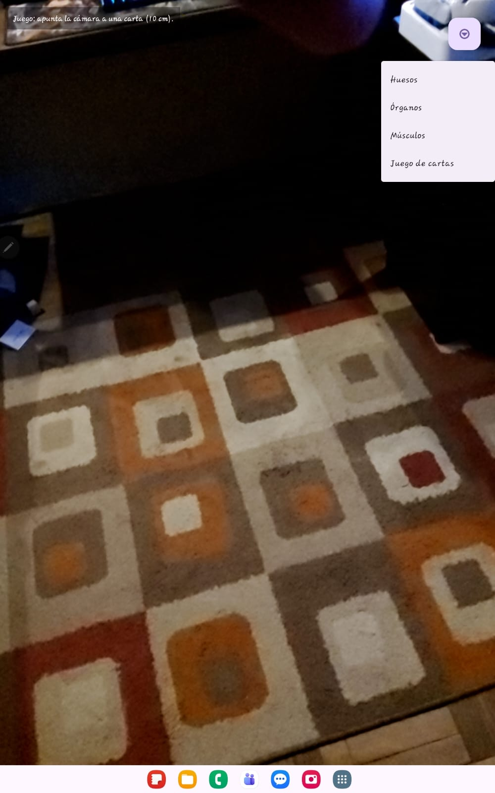
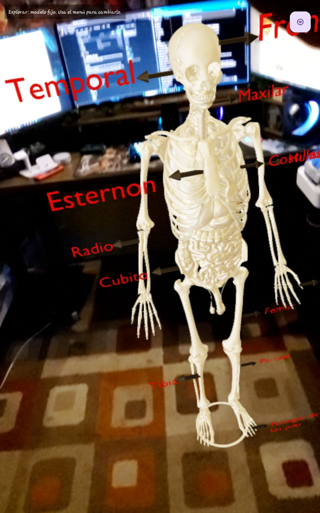

## 📷 Application Screenshots

### Main Menu

The application's main menu allows users to select bones, organs, muscles, and the educational card game.

---

###Head 3D Model

Interactive 3D head model displayed through Augmented Reality after recognizing an anatomy card.

---

### Head Anatomy

Detailed visualization of the muscles, arteries, and structures of the human head.

---

### Skull Anatomy

Interactive skull model with anatomical labels for educational purposes.

---

###Vertebral Column

Interactive vertebral column showing cervical, thoracic, lumbar, sacral, and coccygeal regions.

---

###Human Skeleton

Complete 3D human skeleton with labels identifying the main bones.

