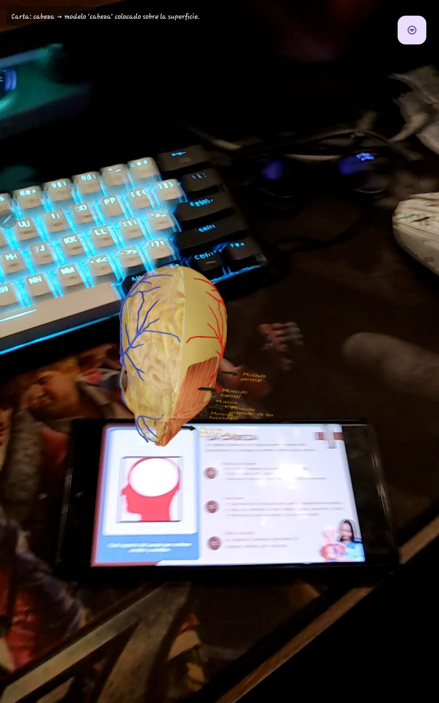
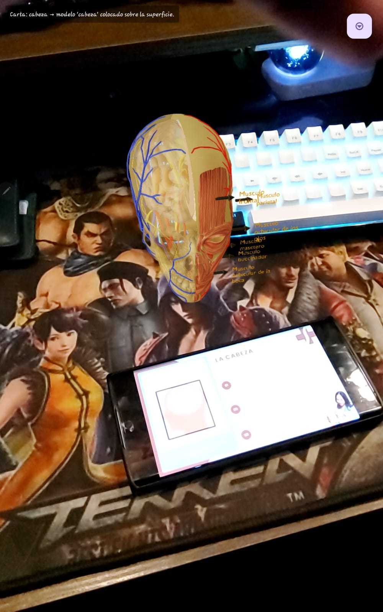
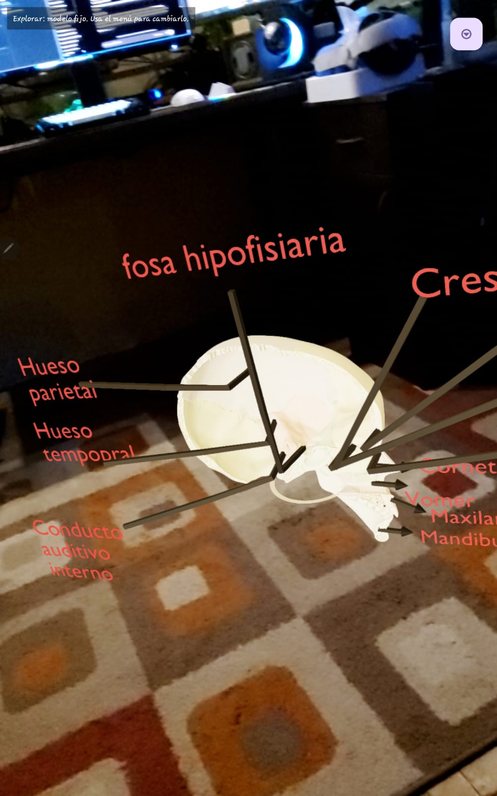
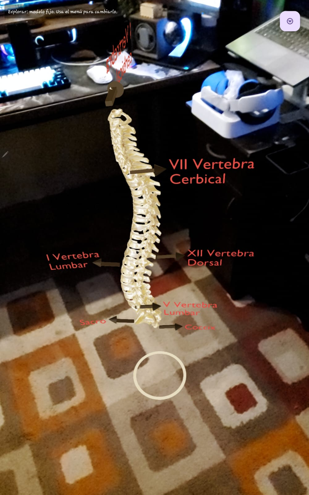

# 🫀 Anatomy AR App

> Educational Android application that uses **Augmented Reality (ARCore)** to teach human anatomy through interactive 3D models.


---

# Overview

Anatomy AR App is an educational mobile application developed in **Kotlin** using **Google ARCore**.

The application allows students to visualize the human body in Augmented Reality, helping them understand anatomy through interactive 3D models.

Users can explore bones, organs and muscles while learning the names and positions of each anatomical structure.

The project was developed as an academic project focused on combining education and emerging technologies.

---

# Features

- Interactive 3D visualization using Augmented Reality
- Anatomy card recognition
- Human skeleton visualization
- Skull anatomy visualization
- Human head anatomy visualization
- Vertebral column visualization
- Educational card game
- Educational audio playback
- Android application developed with Kotlin
- Optimized loading of 3D models

---

# Application Preview

## Main Menu

Users can select different educational modules such as Bones, Organs, Muscles and the Educational Card Game.


---

## Head 3D Model

Interactive 3D head model generated after recognizing an anatomy card.



---

## Head Anatomy

Detailed visualization of muscles, arteries and facial structures.



---

## Skull Anatomy

Interactive skull model with educational labels.



---

## Vertebral Column

Interactive vertebral column showing cervical, thoracic, lumbar, sacral and coccygeal regions.



---

## Human Skeleton

Complete 3D human skeleton with anatomical labels.


---

# Technologies

- Kotlin
- Android Studio
- Google ARCore
- Sceneform
- OpenGL ES
- Gradle
- XML
- Android SDK

---

#  Architecture

```
Android Application
│
├── User Interface
├── Camera
├── ARCore
├── Image Recognition
├── 3D Model Loader
├── Audio Player
└── Educational Modules
```

---

# Project Structure

```
Anatomy-AR-App
│
├── app
├── gradle
├── screenshots
├── README.md
├── LICENSE
├── build.gradle
└── settings.gradle
```

---

# Installation

Clone the repository

```bash
git clone https://github.com/jomel42/anatomy-ar-education.git
```

Open the project using Android Studio.

Sync Gradle.

Connect an Android device compatible with ARCore.

Run the application.

---

# Educational Modules

✔ Bones

✔ Organs

✔ Muscles

✔ Human Skeleton

✔ Skull

✔ Head

✔ Vertebral Column

✔ Educational Card Game

---

# Future Improvements

- More anatomical structures
- Multiple language support
- Interactive quizzes
- Voice recognition
- Educational progress tracking
- Cloud synchronization
- Performance optimization

---

# Author

**Jomel Darío Siñani Orellana**

Full Stack Developer

Systems Engineering Student

São Paulo, Brazil

GitHub:

https://github.com/jomel42

---

# License

This project is licensed under the MIT License.

---

# Support

If you like this project, consider giving it a ⭐ on GitHub.
